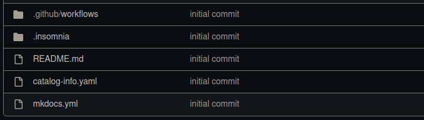

# Insomnia OpenApi Template

## Getting started

**This template offers the developer a project structured by a Insonmia Project, which can be freely modified after generation according to demand.**

### Project structure

## Guide

The `docs` folder will contain the application documentation. It must be edited later according to the project being developed, and this documentation will be available within the **Devportal**.

It is necessary to configure the Github Secret in the project repository, so that the spec is published.

Already in the root of the project are the configuration files.

It is important to emphasize that according to the template, it can be created according to demand and following the architecture that the developer requests.

---

## Pipeline Secrets
For the project to run as expected, it is necessary to configure some secrets in the pipeline, some are optional.

:key: API_TOKEN_GITHUB `mandatory`
