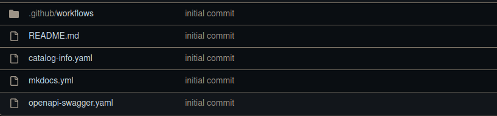

# OpenApi Template

## Getting started

**This template offers the developer a project structured by a OpenApi Project, which can be freely modified after generation according to demand.**

### Template Steps

1- Spec house Configuration

> Define the repository where the generated spec will be published.
>
> In this step we usually define the branch and host, the owner and the name of the repository where the project spec will be published.
> This repository must already exist and be properly structured with a catalog.info in its root, according to the correct syntax used in Backstage.

3- Mock Server Configuration

> In this step, we define the url of the mockserver that will be used in the project.
>
> Note that this url must be live.

2- Choose Location

> This step is usually the last step in a project, where we fill in the details of where the component will be registered and the name of the new repository.

### Project structure

## Guide

The `docs` folder will contain the application documentation. It must be edited later according to the project being developed, and this documentation will be available within the **Devportal**.

It is necessary to configure the Github Secret in the project repository, so that the spec is published.

Already in the root of the project are the configuration files.

It is important to emphasize that according to the template, it can be created according to demand and following the architecture that the developer requests.

---

## Pipeline Secrets
For the project to run as expected, it is necessary to configure some secrets in the pipeline, some are optional.

:key: API_TOKEN_GITHUB `mandatory`