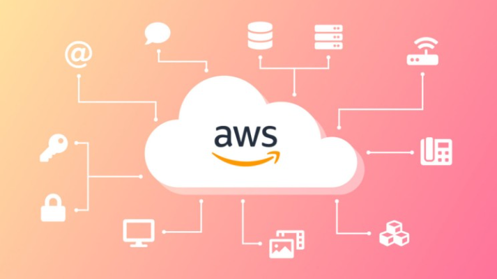
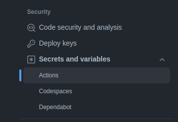
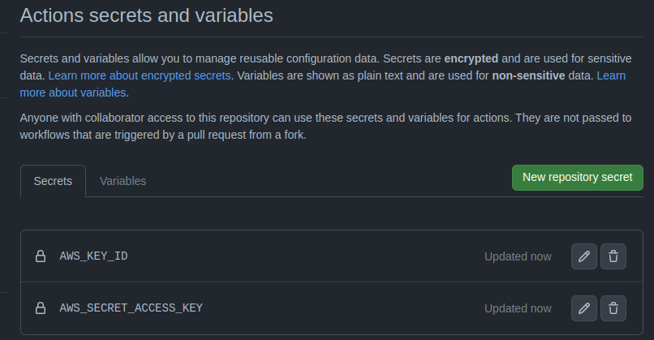

# AWS Lambda with Serverless Template

**Using lambda with the help of serverless, to optimize the use of EC2 infrastructure.**

## Review

In this template we offer the automation of EC2 instances.
Efficient in optimizing unnecessary expenses, with the help of lambda in conjunction with serverless, we managed to define that an EC2 instance does not remain in the air when it is inactive, thus being able to create a routine, with the help of Cron, to start and stop its EC2 , with practicality and without much effort.

### Project structure

With the generation of the template, the following structure will be created:

### .github/workflow

- Where are the github actions pipelines.
### docs

- Where we find the project documentation, by default it will come with basic information, but the user will be able to add details about the final project, and this documentation will be visible within the devportal when the project is cataloged (a process that happens when it is generated) .

> It is important to say that the documentation listens to every change that is made in the code repository, so it will always remain up to date.

### src

- Where is the `handler.js` file, which has the start and stop functions.

### Root Project

- In the root of the project, we have some very important files:

| File              | Explanation                                                                                                                                                                                                                                                                            |
| ----------------- | -------------------------------------------------------------------------------------------------------------------------------------------------------------------------------------------------------------------------------------------------------------------------------------- |
| **.gitignore**       | File in which we add the exceptions that will not be versioned by git.                                                                                                                                                                               |
| **LICENSE**      | the License to use the software.                                                                                                                                                                                                                  |
| **README.md**      | The Project Readme                                                                                                                                                                                                                  |
| **catalog-info.yaml**       | The File responsible for cataloging the project within the devportal.                                                                                                                                                                                                                  |
| **mkdocs.yaml**      | This file is responsible for uploading your project's documentation into the devportal catalog.                              |
| **package-lock.json**      | Default project dependencies file.                                                                                                                                                                                                                  |
| **package.json**      | Default project dependencies file.                                                                                                                                                                                                                  |
| **Serverless.yml** | Important file where we will set the serverless operation settings, setting the start and stop functions. |

 

## Generated project settings

> As requirements you must have serveless (`npm install -g serverless`) and aws cli installed on your machine.

To use the template, the user must clone the code properly configured previously, via devportal, and in the terminal type the command:

~~~bash
npm i

aws configure
    AWS Access Key ID [**********************]: ${{AWS_ACCESS_KEY}}
    AWS Secret Access Key [**********************]: ${{AWS_SECRET_KEY}}
    Default region name [us-east-1]: ${{AWS_REGION}}

sls deploy --stage [${dev | prod}]
~~~

The next step is to configure two environment variables in the repository, namely: `AWS_ACCESS_KEY`, `AWS_SECRET_KEY`.
These variables are the Access Key ID, AWS Secret Access Key. 

To learn how to create keys, visit the <u>[official documentation](https://docs.aws.amazon.com/IAM/latest/UserGuide/id_credentials_access-keys.html#Using_CreateAccessKey)</u>.

 

  

 

With the environment variables defined in the repository, it is now possible to run the pipeline.

### Pipeline

The pipeline is divided into stages (defined at template creation time), and generating the build with automatic start/stop functions and manual start and stop functions.

## Pipeline Secrets
For the project to run as expected, it is necessary to configure some secrets in the pipeline, some are optional.

 AWS_ACCESS_KEY `mandatory`  
 AWS_SECRET_ACCESS_KEY `mandatory`  