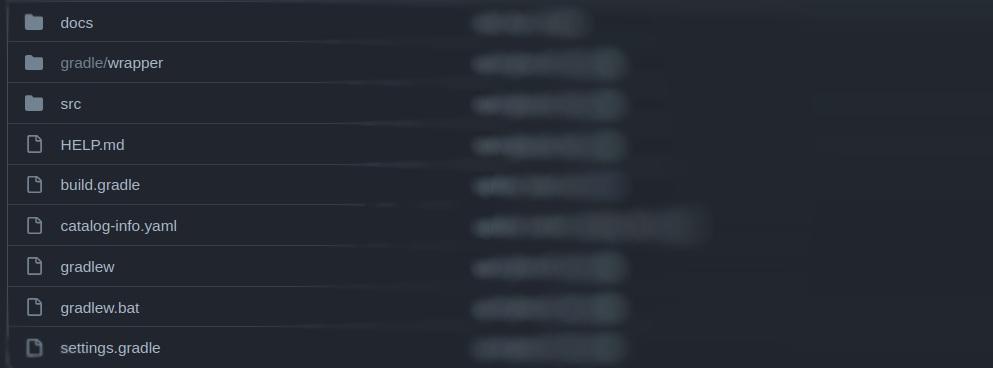

# Springboot Template

## Getting started

**This template offers the developer a project structured with Java and springboot, which can be freely modified after generation according to demand.**

### Template Steps

1- Project Configuration

> We define the component's general information, such as its name, description, artifact, Java version and application port.

2- Database Configuration

> In this step we will include information about the bank used, but it is not obligatory, only if it makes sense.

3- Docker Registry

> In this step, we'll define which dockerhub the image will be published to, whether it's your organization's dockerhub, the user's personal dockerhub or even a generic registry.

4- CI/CD Configurations

> In this step, we basically enter the branch, host, owner and name of the repository where our artifact will be published  for ArgoCD provisioning.
> Note that this repository exists and must be properly configured.
> Finally, we have a simple "Export Kong for Kubernetes" flag;
> And an input to enter the URL of the MockServer.

5- Observability

> Here we will define whether or not to add the observability tool. If the option is to add it, then the actual url of your Grafana dashboard must be provided.

6- Spec house Configuration

> Define the repository where the generated spec will be published.
>
> In this step we usually define the branch and host, the owner and the name of the repository where the project spec will be published.
> This repository must already exist and be properly structured with a catalog.info in its root, according to the correct syntax used in Backstage.

7- Choose Location

> This step is usually the last step in a project, where we fill in the details of where the component will be registered and the name of the new repository.

* * *

### Project structure

## Guide

The `docs` folder will contain the application documentation. It must be edited later according to the project being developed, and this documentation will be available within the **Devportal**.

In the `gradle` folder we will have additional information about the project, such as the properties that will be used.

**exemplo**
~~~conf
distributionBase=GRADLE_USER_HOME
distributionPath=wrapper/dists
distributionUrl=https\://services.gradle.org/distributions/gradle-7.5.1-bin.zip
zipStoreBase=GRADLE_USER_HOME
zipStorePath=wrapper/dists
~~~

In the `src` folder will be the main project files as well as the test ones, in **springboot**.

Already in the root of the project are the configuration files.

It is important to emphasize that according to the template, it can be created according to demand and following the architecture that the developer requests.

---

## Pipeline Secrets
For the project to run as expected, it is necessary to configure some secrets in the pipeline, some are optional.

### Github

🔑 DOCKER_USERNAME `mandatory`  
🔑 DOCKER_PASSWORD `mandatory`  
🔑 API_TOKEN_GITHUB `mandatory`  

### Gitlab

🔑 DOCKER_USERNAME `mandatory`  
🔑 DOCKER_PASSWORD `mandatory`  
🔑 API_TOKEN_GITLAB `mandatory`  

If you choose to use the grafana dashboard settings for the application, you will need to configure the secrets in the project repository

🔑 GRAFANA_API_TOKEN `optional`