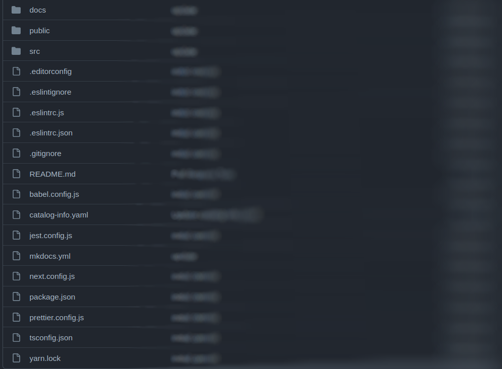
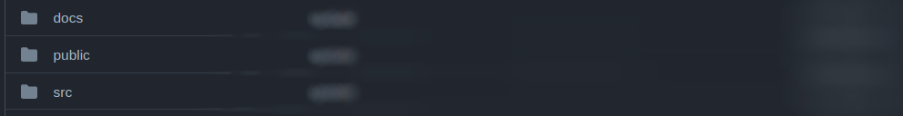
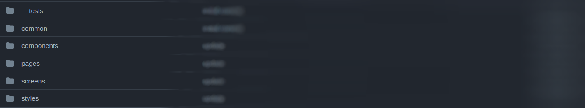
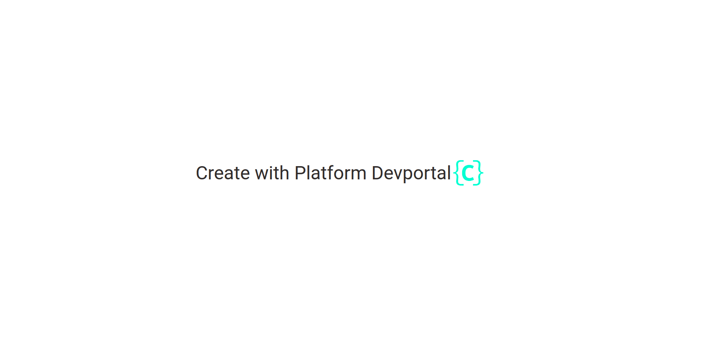

# NextJS Template with Styled Components

**In this model, a NextJS + Typescript application will be delivered, using the Styled-Components lib for styling..**
 
 
>This template aims to meet the demand for frontend interfaces using an agile and performant framework coupled with the powerful css in JS.

## Project structure:

## Guide

**Let's start with the folders...**

 In the `docs` folder, there will be a **markdown** file responsible for storing the software documentation, so once the template is generated it creates standard documentation which can be edited later.
 In the `public` folder on the same level will be the `assets` folder and the `static` folder.
 A very important folder in the project is the `src` folder: 
 
 

 The first folder, `__tests__`, will hold the test files.
 
 In the `common` folder, by default we add a file that will take care of the responsiveness of the project, but it can be fed with more files as needed later.
 
 As the name implies, the `components` folder will hold the global components of the project, by default we create the `globalStyle` folder which will take care of the global styling of the project.
 
 But below that we have the `pages` folder, where we'll put all the files that refer to the project pages, taking into account that **NextJS** automatically routes files from this folder. 
 
 In the `screen' folder we'll follow a screen component separation structure, this will aid development and prevent code from being written directly into the `pages' folder. In the `screen` folder we also take care of the local components and their styles, by default we create the `Homescreen` folder which will be imported into `pages/index.tsx`, as the project's main page.
 
 Finally the last folder in `src`, the `styles` folder, will take care of the project's style, by default we create within it the `theme.ts` file which will provide the style base for the entire project.
 
  
**In the Root of the project ...**
 
 We can highlight the configuration files and also the package.json that holds all the libs used in this template:
 

~~~json
{
  "name": "${{ values.componentId }}",
  "version": "0.1.0",
  "description": "${{ values.description }}",
  "license": "UNLICENSED",
  "scripts": {
    "dev": "next dev",
    "build": "next build",
    "start": "next start",
    "lint": "next lint",
    "test": "web-scripts test --config jest.config.js",
    "pretest:ci": "yarn lint",
    "test:ci": "yarn test --ci --coverage --reporters=default --reporters=jest-junit"
  },
  "dependencies": {
    "@next/font": "13.0.7",
    "@types/node": "^18.11.17",
    "@types/react": "^18.0.26",
    "@types/react-dom": "^18.0.9",
    "@zeit/next-typescript": "^1.1.1",
    "babel-plugin-styled-components": "^2.0.7",
    "eslint": "8.30.0",
    "eslint-config-next": "13.0.7",
    "next": "13.0.7",
    "react": "18.2.0",
    "react-dom": "18.2.0",
    "sass": "^1.55.0",
    "styled-components": "^5.3.6",
    "styled-reset": "^4.4.4",
    "typescript": "4.9.4"
  },
  "devDependencies": {
    "@spotify/tsconfig": "^14.1.3",
    "@spotify/web-scripts": "^14.1.3",
    "@testing-library/react": "^13.4.0",
    "@types/styled-components": "^5.1.26",
    "husky": "^8.0.2",
    "jest-junit": "^15.0.0"
  },
  "husky": {
    "hooks": {
      "pre-commit": "web-scripts precommit"
    }
  },
  "browserslist": {
    "production": [
      ">0.2%",
      "not dead",
      "not op_mini all"
    ],
    "development": [
      "last 1 chrome version",
      "last 1 firefox version",
      "last 1 safari version"
    ]
  }
}
~~~

**Special attention also to the catalog-info.yaml and mkdocs.yml files.**

> The `catalog-info.yaml` is responsible for importing the component into the devportal, and `mkdocs.yml` is responsible for the documentation part of the project.
 
 
### Hands-on:

 This is a clean, freshly created project using the **NextJs** template.
 
 
 
 
