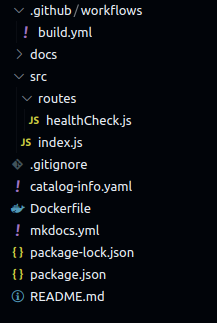
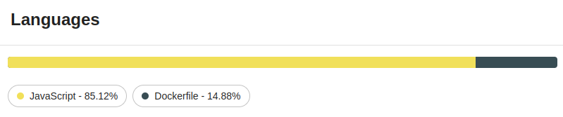
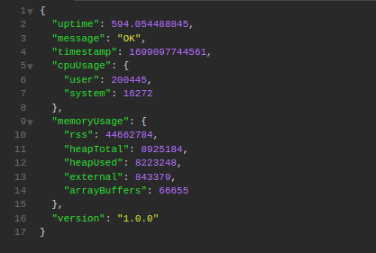

# ExpressJS Template

**Build an api with the simplicity of expressJs, using the best of NodeJS**

### Project structure

### Project Details

### Deploy

### Pipeline Secrets
For the project to run as expected, it is necessary to configure some secrets in the pipeline.

🔑 AWS_ACCESS_KEY `mandatory`  
🔑 AWS_SECRET_KEY `mandatory`  
🔑 AWS_REGION `mandatory`  
🔑 DOCKER_PASSWORD `mandatory`  
🔑 DOCKER_USERNAME `mandatory`  
🔑 API_TOKEN_GITHUB `mandatory`  
